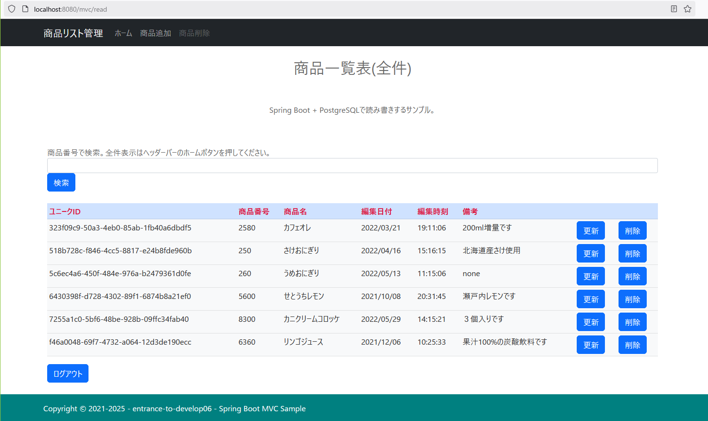
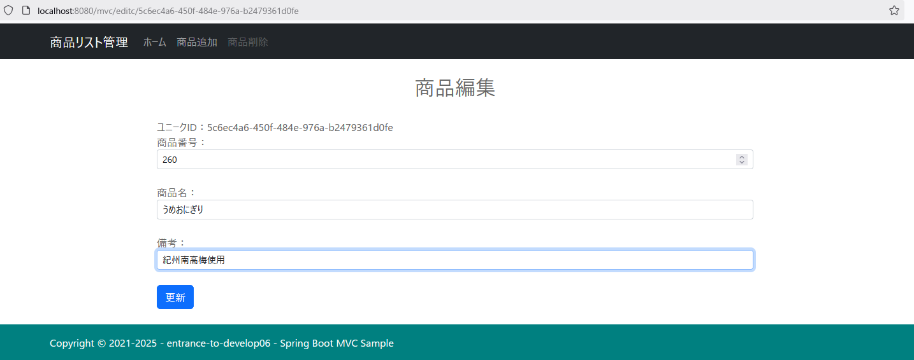

## :leaves: SpringBoot(MVC)での商品管理アプリ・サンプル  

### JPA(O/Rマッピング)を使いデータベースとの読み書き  
### Spring SecurityのForm認証を扱う

## 1. 開発環境  
```
統合開発環境：JetBrains IntelliJ IDEA Community Edition 2024.3.2 + Spring Initializr  
プログラム言語：Java 21  
開発SDK：Oracle JDK 21.0.5  
フレームワーク：Spring Boot 3.4.1  
-Spring Framework 6.2.1  
-サーブレットエンジン：Apache Tomcat 10.1.34  
-テンプレートエンジン：Thymeleaf 3.1.3.RELEASE  
-データベース接続：PostgreSQL JDBC 4.2 Driver 42.7.5またはOracle Database Driver ojdbc8  
-O/R マッピング フレームワーク：Hibernate ORM 6.5.2.Final + JPA 3.1.0  
-ログイン認証:Spring Security 6.6.4
ログイン認証：Form認証
データベース：PostgreSQL 17.2またはOracle Database 21c Express
-データベース管理ツール：pgAdmin 8.14またはOracle SQL Developer 23.1
ビルドツール： Gradle 8.12 Groovy
CSSテンプレート：Bootstrap 5.2.3
```

<br />

## 2. 事前準備  
### サンプルプログラムを実行する際のデータベース作成  
PostgreSQLのクエリーやpgAdminのクエリーツールで以下のSQLを実行するかこれ相当をpgAdminなどの管理ツールのデータベース作成で作成します。  

#### データベース作成(pgAdminでのデフォルト相当)  
データベース名は`SpringBootPostgres`です。  

```
-- Database: SpringBootPostgres

-- DROP DATABASE IF EXISTS "SpringBootPostgres";

CREATE DATABASE "SpringBootPostgres"
    WITH 
    OWNER = postgres
    ENCODING = 'UTF8'
    LC_COLLATE = 'Japanese_Japan.932'
    LC_CTYPE = 'Japanese_Japan.932'
    TABLESPACE = pg_default
    CONNECTION LIMIT = -1;
````

#### テーブル作成およびサンプルデータ  
SpringJpaの機能および設定によりテーブルが無ければ作成しますので必要ありません。  
サンプルデータもデータが１件も無ければプログラムにより作成する様になっていますので必要ありません。  


<br />

## 3. 実行イメージ  
#### 画面・イメージ／一覧  
  

#### 画面・イメージ／更新  


#### データベース管理ツール・イメージ／テーブル  
  
  